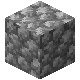
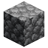
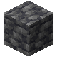
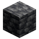
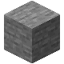
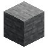
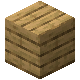
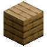

# Vanilla lighting comparison

Each image is rendered from the same source texture at 80x80. The left column
uses the deterministic inventory-style `vanilla` preset; the right column uses
the previous physically lit `right_light` preset.

| Block | Vanilla | Right light |
| --- | --- | --- |
| Cobblestone |  |  |
| Deepslate |  |  |
| Stone |  |  |
| Oak planks |  |  |
